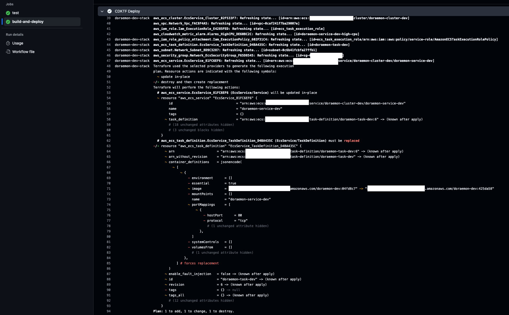
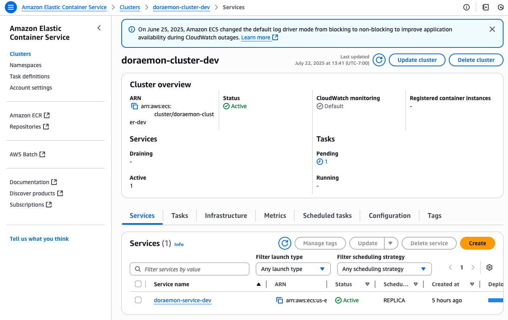

# ✅ Proof of Deployment

This document contains visual evidence that the infrastructure and application have been successfully deployed using Terraform (CDKTF), Docker, and GitHub Actions CI/CD workflows.

Each screenshot below demonstrates a key milestone in the full lifecycle pipeline:

---

## 🗃️ 1. Terraform Backend (S3 & DynamoDB) Setup

- **S3 State Bucket**

  

  > Terraform remote state is stored securely in the S3 bucket.

- **DynamoDB Lock Table**

  

  > DynamoDB is used for state locking and consistency.

---

## 🧪 2. Tests Passing

> Unit tests executed and passed successfully during the CI pipeline.

---

## 📦 3. ECR Repository Created

> The private ECR repository was provisioned using Terraform and is ready to store Docker images for each environment.

---

## 🚀 4. Successful GitHub Actions Deployment

- **Completed CI/CD Workflow**

  

  > GitHub Actions pipeline executed all build, test, and deploy steps without errors.

- **Terraform Deployment Triggered**

  

  > A new infrastructure change was applied successfully using `cdktf deploy`.

---

## ⚙️ 5. ECS Cluster and Service Running

> The ECS cluster, task definition, and Fargate service have been successfully created and are running.

--

## ✅ Conclusion

These screenshots validate that the application and infrastructure pipeline is:

- Fully automated via CI/CD
- Secure and modular through CDK for Terraform
- Deployed across environments with proper separation

For more context, refer to:

- [Main Project README](../README.md)
- [Infrastructure (`iac/`) README](../iac/README.md)
- [Application (`app/`) README](../app/README.md)
